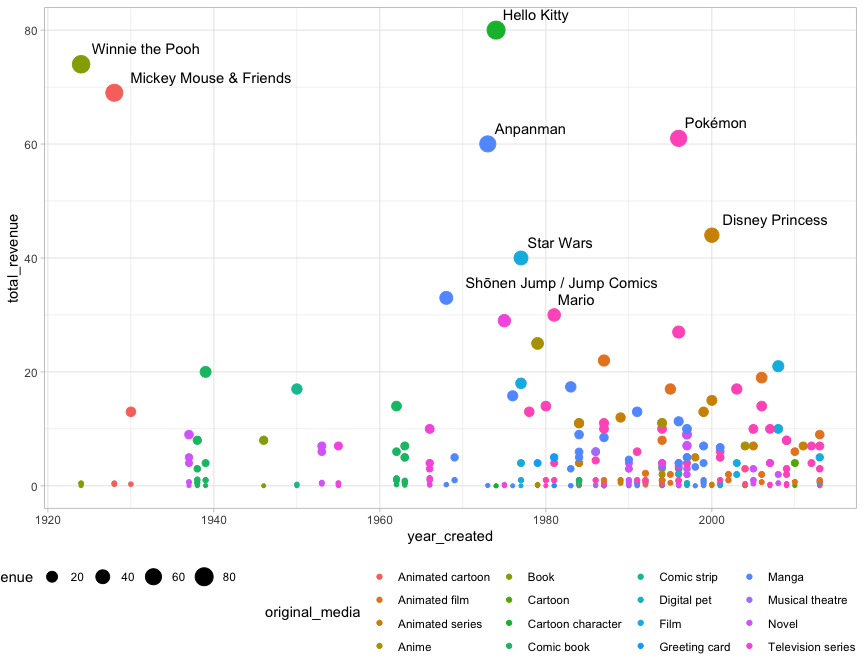

franchise
================

# Libraries

[Ссылка на описание
данных](https://github.com/rfordatascience/tidytuesday/tree/master/data/2019/2019-07-02)

# Получение данных

``` r
media_franchises <- readr::read_csv("https://raw.githubusercontent.com/rfordatascience/tidytuesday/master/data/2019/2019-07-02/media_franchises.csv")
```

    ## 
    ## ── Column specification ────────────────────────────────────────────────────────
    ## cols(
    ##   franchise = col_character(),
    ##   revenue_category = col_character(),
    ##   revenue = col_double(),
    ##   year_created = col_double(),
    ##   original_media = col_character(),
    ##   creators = col_character(),
    ##   owners = col_character()
    ## )

``` r
# revenue = доход в миллиардах
```

# Обработка данных

``` r
media_franchises %>% 
  count(franchise, sort = TRUE)
```

    ## # A tibble: 103 × 2
    ##    franchise                                     n
    ##    <chr>                                     <int>
    ##  1 Spider-Man                                    7
    ##  2 Dragon Ball                                   6
    ##  3 Final Fantasy                                 6
    ##  4 Neon Genesis Evangelion                       6
    ##  5 Star Wars                                     6
    ##  6 Superman                                      6
    ##  7 Wizarding World / Harry Potter                6
    ##  8 A Song of Ice and Fire /  Game of Thrones     5
    ##  9 Aladdin                                       5
    ## 10 Detective Conan / Case Closed                 5
    ## # … with 93 more rows

``` r
franchises <- media_franchises %>% 
  group_by(revenue, franchise, original_media, year_created, creators, owners) %>% 
  summarise(categories = n(),
            total_revenue = sum(revenue),
            most_profitable = revenue_category[which.max(revenue)]) %>% 
  ungroup()
```

    ## `summarise()` has grouped output by 'revenue', 'franchise', 'original_media', 'year_created', 'creators'. You can override using the `.groups` argument.

## Уровень франшиз

Какие франшизы были самыми большими

``` r
franchises %>% 
  arrange(desc(revenue)) %>% 
  head(16) %>% 
  mutate(franchise = fct_reorder(franchise, revenue)) %>% 
  ggplot(aes(franchise, revenue)) +
  geom_col() +
  coord_flip() +
  labs(title = "Какие франшизы принесли больше всего денег, с момента их создания") +
  theme(legend.position = "bottom")
```

<!-- -->

``` r
media_franchises %>% 
  semi_join(franchises %>% top_n(16, total_revenue), by = "franchise") %>% 
  mutate(franchise = glue("{ franchise } ({ year_created})")) %>% 
   mutate(franchise = fct_reorder(franchise, revenue, sum),
          revenue_category = fct_reorder(revenue_category, revenue, sum)) %>% 
  ggplot(aes(franchise, revenue, fill = revenue_category)) +
  scale_y_continuous(labels = scales::dollar) +
  geom_col() +
  coord_flip() +
  guides(fill = guide_legend(reverse = TRUE)) +
  labs(title = "Какие франшизы принесли больше всего денег, с момента их создания",
       fill = "Категория",
       x = "",
       y = "Миллиарды долларов") +
  theme(legend.position = "bottom")
```

<!-- -->

Какие компании больше всего заработали на каких франшизах

``` r
franchises %>% 
  group_by(owners) %>% 
  filter(n() > 1) %>% 
  ungroup() %>% 
  mutate(franchise = glue("{ franchise } ({ year_created})")) %>% 
  mutate(franchise = fct_reorder(franchise, total_revenue),
         owners = fct_reorder(owners, -total_revenue, sum)) %>% 
  ggplot(aes(franchise, total_revenue, fill = original_media)) +
  geom_col() +
  facet_wrap(~owners, scales = "free_y") +
  coord_flip() +
  theme(legend.position = "bottom")
```

<!-- -->

``` r
media_franchises %>% 
  group_by(owners) %>% 
  filter(n_distinct(franchise) > 2) %>% 
  ungroup() %>% 
  mutate(franchise = glue("{ franchise } ({ year_created})")) %>% 
  mutate(franchise = fct_reorder(franchise, revenue, sum),
         owners = fct_reorder(owners, -revenue, sum),
         revenue_category = fct_reorder(revenue_category, revenue, sum)) %>%
  ggplot(aes(franchise, revenue, fill = revenue_category)) +
  geom_col() +
  facet_wrap(~owners, scales = "free_y") +
  coord_flip() +
  scale_y_continuous(labels = scales::dollar) +
  guides(fill = guide_legend(reverse = TRUE)) +
  theme(legend.position = "bottom") +
  labs(title = " Какие компании обладают по меньшей мере тремя франшизами",
       fill = "категория франшизы",
       x = "",
       y = "Миллиарды долларов")
```

<!-- -->

Посмотрим в разрезе года основания

``` r
franchises %>% 
  mutate(label = ifelse(total_revenue < 30, NA_character_, franchise)) %>% 
  ggplot(aes(year_created, total_revenue)) +
  geom_point(aes(size = total_revenue, color = original_media)) +
  geom_text(aes(label = label), hjust = -0.1, vjust = -1) +
  theme(legend.position = "bottom")
```

    ## Warning: Removed 302 rows containing missing values (geom_text).

<!-- -->
