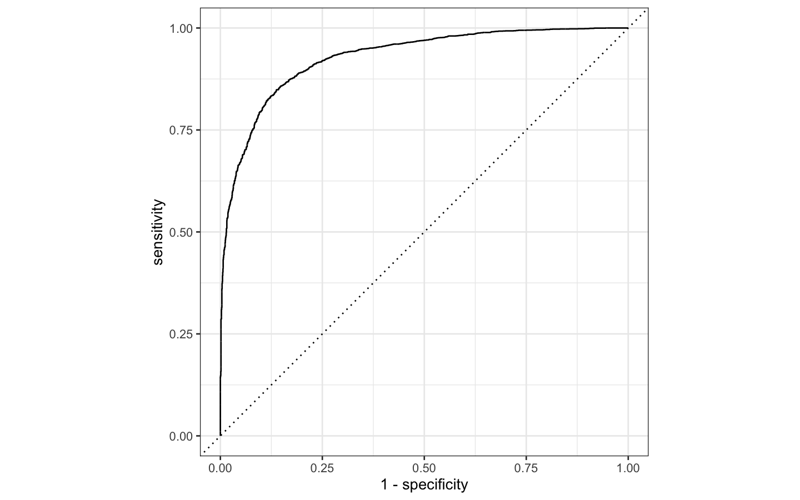

Housing
================
Stas Masiuta
2021-07-27

# Libraries

``` r
library(tidyverse)
library(stringr)
library(GGally)
library(tidymodels)
library(skimr)      # сводка по данным
library(ggmap)      # отрисовка карт
library(vip)        # визуализация важности предикторов
```

# Task

Будем анализировать данные о ценах на жильё в Калифорнии.

Задача — Построить модель, которая будет предсказывать цену на жилье.

Для упрощения, цену на жильё выразим номинативной переменной с двумя
градациями — больше 150000 долларов и ниже этой суммы.

# Explore data

## Import

``` r
housing_df <- read_csv("https://raw.githubusercontent.com/kirenz/datasets/master/housing_unclean.csv")
```

## Clean

``` r
housing_df %>% glimpse()
```

    ## Rows: 20,640
    ## Columns: 10
    ## $ longitude          <dbl> -122.23, -122.22, -122.24, -122.25, -122.25, -122.2…
    ## $ latitude           <dbl> 37.88, 37.86, 37.85, 37.85, 37.85, 37.85, 37.84, 37…
    ## $ housing_median_age <chr> "41.0years", "21.0", "52.0", "52.0", "52.0", "52.0"…
    ## $ total_rooms        <dbl> 880, 7099, 1467, 1274, 1627, 919, 2535, 3104, 2555,…
    ## $ total_bedrooms     <dbl> 129, 1106, 190, 235, 280, 213, 489, 687, 665, 707, …
    ## $ population         <dbl> 322, 2401, 496, 558, 565, 413, 1094, 1157, 1206, 15…
    ## $ households         <dbl> 126, 1138, 177, 219, 259, 193, 514, 647, 595, 714, …
    ## $ median_income      <dbl> 8.3252, 8.3014, 7.2574, 5.6431, 3.8462, 4.0368, 3.6…
    ## $ median_house_value <chr> "452600.0$", "358500.0", "352100.0", "341300.0", "3…
    ## $ ocean_proximity    <chr> "NEAR BAY", "NEAR BAY", "NEAR BAY", "NEAR BAY", "NE…

Мы видим, что некоторые параметры «замусорены»

-   в годах есть слово years
-   в стоимости есть символ доллара
-   плюс оба эти параметра символьные, хотя по идее представляют
    численные значения.

Очистим символы и конвертируем в численное представление

``` r
housing_df <- 
  housing_df %>% 
  mutate(
    housing_median_age = str_remove_all(housing_median_age, "[years]"),
    housing_median_age = as.numeric(housing_median_age),
    median_house_value = str_remove_all(median_house_value, "[$]"),
    median_house_value = as.numeric(median_house_value),
    ocean_proximity = factor(ocean_proximity)
  )
```

``` r
housing_df %>% glimpse()
```

    ## Rows: 20,640
    ## Columns: 10
    ## $ longitude          <dbl> -122.23, -122.22, -122.24, -122.25, -122.25, -122.2…
    ## $ latitude           <dbl> 37.88, 37.86, 37.85, 37.85, 37.85, 37.85, 37.84, 37…
    ## $ housing_median_age <dbl> 41, 21, 52, 52, 52, 52, 52, 52, 42, 52, 52, 52, 52,…
    ## $ total_rooms        <dbl> 880, 7099, 1467, 1274, 1627, 919, 2535, 3104, 2555,…
    ## $ total_bedrooms     <dbl> 129, 1106, 190, 235, 280, 213, 489, 687, 665, 707, …
    ## $ population         <dbl> 322, 2401, 496, 558, 565, 413, 1094, 1157, 1206, 15…
    ## $ households         <dbl> 126, 1138, 177, 219, 259, 193, 514, 647, 595, 714, …
    ## $ median_income      <dbl> 8.3252, 8.3014, 7.2574, 5.6431, 3.8462, 4.0368, 3.6…
    ## $ median_house_value <dbl> 452600, 358500, 352100, 341300, 342200, 269700, 299…
    ## $ ocean_proximity    <fct> NEAR BAY, NEAR BAY, NEAR BAY, NEAR BAY, NEAR BAY, N…

``` r
housing_df %>% 
  count(ocean_proximity, sort = TRUE)
```

    ## # A tibble: 5 × 2
    ##   ocean_proximity     n
    ##   <fct>           <int>
    ## 1 <1H OCEAN        9136
    ## 2 INLAND           6551
    ## 3 NEAR OCEAN       2658
    ## 4 NEAR BAY         2290
    ## 5 ISLAND              5

Теперь посмотрим в целом на данные.

``` r
housing_df %>% skim()
```

|                                                  |            |
|:-------------------------------------------------|:-----------|
| Name                                             | Piped data |
| Number of rows                                   | 20640      |
| Number of columns                                | 10         |
| \_\_\_\_\_\_\_\_\_\_\_\_\_\_\_\_\_\_\_\_\_\_\_   |            |
| Column type frequency:                           |            |
| factor                                           | 1          |
| numeric                                          | 9          |
| \_\_\_\_\_\_\_\_\_\_\_\_\_\_\_\_\_\_\_\_\_\_\_\_ |            |
| Group variables                                  | None       |

Data summary

**Variable type: factor**

| skim\_variable   | n\_missing | complete\_rate | ordered | n\_unique | top\_counts                                   |
|:-----------------|-----------:|---------------:|:--------|----------:|:----------------------------------------------|
| ocean\_proximity |          0 |              1 | FALSE   |         5 | &lt;1H: 9136, INL: 6551, NEA: 2658, NEA: 2290 |

**Variable type: numeric**

| skim\_variable       | n\_missing | complete\_rate |      mean |        sd |       p0 |       p25 |       p50 |       p75 |      p100 | hist  |
|:---------------------|-----------:|---------------:|----------:|----------:|---------:|----------:|----------:|----------:|----------:|:------|
| longitude            |          0 |           1.00 |   -119.57 |      2.00 |  -124.35 |   -121.80 |   -118.49 |   -118.01 |   -114.31 | ▂▆▃▇▁ |
| latitude             |          0 |           1.00 |     35.63 |      2.14 |    32.54 |     33.93 |     34.26 |     37.71 |     41.95 | ▇▁▅▂▁ |
| housing\_median\_age |          0 |           1.00 |     28.64 |     12.59 |     1.00 |     18.00 |     29.00 |     37.00 |     52.00 | ▃▇▇▇▅ |
| total\_rooms         |          0 |           1.00 |   2635.76 |   2181.62 |     2.00 |   1447.75 |   2127.00 |   3148.00 |  39320.00 | ▇▁▁▁▁ |
| total\_bedrooms      |        207 |           0.99 |    537.87 |    421.39 |     1.00 |    296.00 |    435.00 |    647.00 |   6445.00 | ▇▁▁▁▁ |
| population           |          0 |           1.00 |   1425.48 |   1132.46 |     3.00 |    787.00 |   1166.00 |   1725.00 |  35682.00 | ▇▁▁▁▁ |
| households           |          0 |           1.00 |    499.54 |    382.33 |     1.00 |    280.00 |    409.00 |    605.00 |   6082.00 | ▇▁▁▁▁ |
| median\_income       |          0 |           1.00 |      3.87 |      1.90 |     0.50 |      2.56 |      3.53 |      4.74 |     15.00 | ▇▇▁▁▁ |
| median\_house\_value |          0 |           1.00 | 206855.82 | 115395.62 | 14999.00 | 119600.00 | 179700.00 | 264725.00 | 500001.00 | ▅▇▅▂▂ |

-   Есть пропущенные данные в переменной `total_bedrooms`
-   Довольно большой разброс у численных переменных не связанных с
    координатами
-   У численных переменных распределение с длинным правым хвостом
-   Данные нужно нормализовать

## Работа с пропущенными данными

Пропущенные данные можно как исключить из выборки, так и заменить их на
среднее значение, напрмиер по страте.

Посмотрим, какой процент составляют пропущенные значения в каждой из
групп

``` r
housing_df %>% 
  count(ocean_proximity, name = "whole_data") %>% 
  left_join(housing_df %>% 
              filter(is.na(total_bedrooms)) %>% 
              count(ocean_proximity, name = "na_count")) %>% 
  mutate(na_rate = na_count/whole_data)
```

    ## # A tibble: 5 × 4
    ##   ocean_proximity whole_data na_count  na_rate
    ##   <fct>                <int>    <int>    <dbl>
    ## 1 <1H OCEAN             9136      102  0.0112 
    ## 2 INLAND                6551       55  0.00840
    ## 3 ISLAND                   5       NA NA      
    ## 4 NEAR BAY              2290       20  0.00873
    ## 5 NEAR OCEAN            2658       30  0.0113

около одного процента по каждой из групп. Думаю, что можно просто
удалить эти пропуски. Сделаем это в дальнейшем, при составлении рецепта

## Новые переменные

Заметим, что могут быть интересны следующие параметры

-   комнат на одно домохозяйство
-   спален на квартиру
-   жителей в одном домохозяйстве

``` r
housing_df <- 
  housing_df %>% 
  mutate(rooms_per_household = total_rooms/households,
        bedrooms_per_room = total_bedrooms/total_rooms,
        population_per_household = population/households)
```

Кроме того, создадим переменную, которую будем предсказывать

``` r
housing_df <- 
  housing_df %>% 
  mutate(price_category = case_when( 
    median_house_value < 150000 ~ "below",
    median_house_value >= 150000 ~ "above",
    )) %>% 
  mutate(price_category = as.factor(price_category)) %>% 
  select(-median_house_value)
```

Так как мы создали переменную на основе цены, чтобы эта цена не попала в
предикторы, уберём её из датасета

``` r
housing_df %>% 
  count(price_category, 
        name ="districts_total")
```

    ## # A tibble: 2 × 2
    ##   price_category districts_total
    ##   <fct>                    <int>
    ## 1 above                    13084
    ## 2 below                     7556

## EDA

``` r
housing_df %>% 
  select(
    housing_median_age, 
    median_income, bedrooms_per_room, rooms_per_household, 
    population_per_household, ocean_proximity,
    price_category) %>% 
  ggpairs()
```

<!-- -->

В основном, мы уже выше отметили, что численные значения имеют длинный
правый хвост.

### География

Диаграмма рассеяния долготы и широты, на которой выделяются области с
высокой плотностью квартир

``` r
housing_df %>% 
  ggplot(aes(x = longitude, y = latitude)) +
  geom_point(color = "blue", alpha = 0.1)
```

<!-- -->

На графике ниже видно, что дома западнее дешевле, а восточнее дороже

``` r
housing_df %>% 
  ggplot(aes(x = longitude, y = latitude)) +
  geom_point(aes(size = population, color = price_category), 
             alpha = 0.4)
```

<!-- -->

Посмотрим почему так, на реальной карте

``` r
qmplot(x = longitude, 
       y = latitude, 
       data = housing_df, 
       geom = "point", 
       color = price_category, 
       size = population,
       alpha = 0.4) +
  scale_alpha(guide = 'none')
```

<!-- -->

Стало понятнее — жильё ближе к океану дешевле, чем ближе к горам. Это
может объясняться разными причинами — вид (океан или горы), опасность
наводнений, сложность логистики и т.п. В наших данных такой информации
нет, но координаты являются важной предсказательной особенностью.
Которую мы вероятно оставим в данных, для последующего анализа.

### Числовые переменные

Посмотрим как распределяется цена в зависимости от категории

``` r
housing_df %>% 
  ggplot(aes(x = price_category, y = median_income, 
             fill = price_category, color = price_category)) +
  geom_boxplot(alpha=0.4) 
```

<!-- -->

Оптимизируем построение графиков. Построим сразу ящики с усами для всех
численных переменных.

Для этого напишем функцию, которая будет принимать названия переменных и
подставлять их в график `ggplot`

``` r
print_boxplot <- function(.y_var){
  
  # convert strings to variable
  y_var <- sym(.y_var) 
 
  # unquote variables using {{}}
  housing_df %>% 
  ggplot(aes(x = price_category, y = {{y_var}},
             fill = price_category, color = price_category)) +
  geom_boxplot(alpha=0.4) 
  
}
```

Получаем имена всех переменных

``` r
y_var <- 
  housing_df %>% 
  select(where(is.numeric), -longitude, - latitude) %>% 
  variable.names()
```

Итеративно передаём все переменные в нашу новую функцию.

``` r
map(y_var, print_boxplot)
```

    ## [[1]]

<!-- -->

    ## 
    ## [[2]]

<!-- -->

    ## 
    ## [[3]]

<!-- -->

    ## 
    ## [[4]]

<!-- -->

    ## 
    ## [[5]]

<!-- -->

    ## 
    ## [[6]]

<!-- -->

    ## 
    ## [[7]]

<!-- -->

    ## 
    ## [[8]]

<!-- -->

    ## 
    ## [[9]]

<!-- -->

По полученным графикам можно сказать следующее:

-   Различия между двумя группами довольно малы для
    `housing_median_age`, `total_room`, `total_bedrooms`, `population` и
    `households`
-   Мы можем наблюдать заметную разницу для наших переменных
    `median_income` и `bedrooms_per_room`
-   `population_per_household` и `rooms_per_household` включают
    некоторые выбросы.

Отфильтруем выбросы, для этого мы просто установим порог, после которого
явные выбросы будут исключены из выборки.

Сделаем это при помощи следующей функции:

``` r
print_boxplot_out <- function(.y_var_out){
  
  y_var <- sym(.y_var_out) 
 
  housing_df %>% 
  filter(rooms_per_household < 50, population_per_household < 20) %>% 
  ggplot(aes(x = price_category, y = {{y_var}},
             fill = price_category, color = price_category)) +
  geom_boxplot(alpha=0.4) 
  
} 

y_var_out <- 
  housing_df %>% 
  select(rooms_per_household, population_per_household) %>% 
  variable.names() 

map(y_var_out, print_boxplot_out)
```

    ## [[1]]

<!-- -->

    ## 
    ## [[2]]

<!-- -->

Теперь мы можем заметить небольшую разницу для
`population_per_household`. Тогда как распределение
`rooms_per_householdс` напротив, очень похоже для обеих групп.

#### Логарифмическое преобразование

Мы помним, что почти у всех количественных переменных идёт скос вправо.
Для того чтобы нивелировать этот эффект можно применить степенное
преобразование

``` r
housing_df %>% 
  ggplot(aes(x = price_category, y = rooms_per_household,
             fill = price_category, color = price_category)) +
  geom_boxplot(alpha=0.4) +
  scale_y_log10()
```

<!-- -->

Данное преобразование несколько уменьшает хвост, но конечно не делает
его идеально нормальным. Однако даже такой эффект будет ощутим

``` r
housing_df %>% 
  ggplot(aes(x = rooms_per_household)) +
  geom_histogram() +
  scale_y_log10()
```

<!-- -->

### Категориальные данные

## Build model

### Разделение данных

Отберём только те переменные, которые показались нам оптимальными для
предсказания

``` r
housing_df_new <-
  housing_df %>% 
  select(
    longitude, latitude, 
    price_category, 
    median_income, 
    ocean_proximity, 
    bedrooms_per_room, 
    rooms_per_household, 
    population_per_household)
```

Перед тем как мы поделим данные на тренировочный и тестовый датасеты,
посмотрим на то, как распределены два предсказываемых класса.

``` r
housing_df_new %>% 
  ggplot(aes(price_category)) +
  geom_bar() 
```

<!-- -->

Значений `below` несколько меньше `above`. Чтобы предсказываемая оценка
не получилась смещённой, при разделении используем параметр strata.

``` r
set.seed(123)

data_split <- initial_split(housing_df_new, 
                           prop = 3/4, 
                           strata = price_category)

train_data <- training(data_split) 
test_data <- testing(data_split)
```

### Создание рецепта

``` r
housing_rec <-
  recipe(price_category ~ .,
         data = train_data) %>%
  update_role(longitude, latitude, 
              new_role = "ID") %>% 
  step_log(
    median_income,
    bedrooms_per_room, 
    rooms_per_household, 
    population_per_household
    ) %>% 
  step_naomit(everything(), skip = TRUE) %>% 
  step_novel(all_nominal(), -all_outcomes()) %>%
  step_normalize(all_numeric(), -all_outcomes(), 
                 -longitude, -latitude) %>% 
  step_dummy(all_nominal(), -all_outcomes()) %>%
  step_zv(all_numeric(), -all_outcomes()) %>%
  step_corr(all_predictors(), threshold = 0.7, method = "spearman") 
```

Что мы тут сделали \* `update_role()` — мы хотим оставить координаты, но
не включаем их предикторами в модель \* `step_log()` — применяем
степенное преобразование переменных, чтобы нивелировать правый скос
распределений \* `step_naomit()` — исключаем пропущенные данные \*
`step_novel()` — преобразует все номинальные переменные в факторы \*
`step_normalize()` — делаем z-преобразование, нормализуем численные
переменные \* `step_dummy()` — делает из факторных переменных
дамми-переменные \* `step_zv()` — исключаем все переменные с нулевой
дисперсией. \* `step_corr()` — исключаем все переменные которые сильно
коррелируют между собой

``` r
summary(housing_rec)
```

    ## # A tibble: 8 × 4
    ##   variable                 type    role      source  
    ##   <chr>                    <chr>   <chr>     <chr>   
    ## 1 longitude                numeric ID        original
    ## 2 latitude                 numeric ID        original
    ## 3 median_income            numeric predictor original
    ## 4 ocean_proximity          nominal predictor original
    ## 5 bedrooms_per_room        numeric predictor original
    ## 6 rooms_per_household      numeric predictor original
    ## 7 population_per_household numeric predictor original
    ## 8 price_category           nominal outcome   original

Таким образом, у нас получилось 5 предикторов: \* median\_income \*
ocean\_proximity \* bedrooms\_per\_room \* rooms\_per\_household \*
population\_per\_household

``` r
housing_rec %>%
  prep() %>%
  juice() %>% 
  glimpse()
```

    ## Rows: 15,325
    ## Columns: 10
    ## $ longitude                  <dbl> -122.23, -122.22, -122.24, -122.25, -122.25…
    ## $ latitude                   <dbl> 37.88, 37.86, 37.85, 37.85, 37.85, 37.84, 3…
    ## $ median_income              <dbl> 1.842052e+00, 1.836006e+00, 1.552164e+00, 2…
    ## $ rooms_per_household        <dbl> 1.06765323, 0.65680009, 1.69028872, 0.68220…
    ## $ population_per_household   <dbl> -0.39136349, -1.09967453, -0.05077785, -0.9…
    ## $ price_category             <fct> above, above, above, above, above, above, a…
    ## $ ocean_proximity_INLAND     <dbl> 0, 0, 0, 0, 0, 0, 0, 0, 0, 0, 0, 0, 0, 0, 0…
    ## $ ocean_proximity_ISLAND     <dbl> 0, 0, 0, 0, 0, 0, 0, 0, 0, 0, 0, 0, 0, 0, 0…
    ## $ ocean_proximity_NEAR.BAY   <dbl> 1, 1, 1, 1, 1, 1, 1, 1, 1, 1, 1, 1, 1, 1, 1…
    ## $ ocean_proximity_NEAR.OCEAN <dbl> 0, 0, 0, 0, 0, 0, 0, 0, 0, 0, 0, 0, 0, 0, 0…

### Валидационный набор

Соберём валидационный набор

``` r
set.seed(100)

cv_folds <-
 vfold_cv(train_data, 
          v = 5, 
          strata = price_category)
```

### Логистическая регрессия

``` r
log_spec <- 
  logistic_reg() %>% 
  set_engine(engine = "glm") %>%
  set_mode("classification")
```

### Случайный лес

``` r
rf_spec <- 
  rand_forest() %>% 
  set_engine("ranger", importance = "impurity") %>% 
  set_mode("classification")
```

### XGBoost

``` r
xgb_spec <- 
  boost_tree() %>% 
  set_engine("xgboost") %>% 
  set_mode("classification") 
```

### Случайный сосед

``` r
knn_spec <- 
  nearest_neighbor(neighbors = 4) %>%
  set_engine("kknn") %>% 
  set_mode("classification") 
```

### Нейронная сеть

``` r
nnet_spec <-
  mlp() %>%
  set_mode("classification") %>% 
  set_engine("keras") 
```

## Рабочий процесс

### Для lgm

``` r
log_wflow <-
 workflow() %>%
 add_recipe(housing_rec) %>% 
 add_model(log_spec)
```

### Для random forest

``` r
rf_wflow <-
 workflow() %>%
 add_recipe(housing_rec) %>% 
 add_model(rf_spec) 
```

### Для XGBoost

``` r
xgb_wflow <-
 workflow() %>%
 add_recipe(housing_rec) %>% 
 add_model(xgb_spec)
```

### Для kknn

``` r
knn_wflow <-
 workflow() %>%
 add_recipe(housing_rec) %>% 
 add_model(knn_spec)
```

### Для нейронки

``` r
nnet_wflow <-
 workflow() %>%
 add_recipe(housing_rec) %>% 
 add_model(nnet_spec)
```

## Оценка моделей

### glm

Нафитим модель с использованием алгоритма glm

``` r
get_model <- function(x) {
  pull_workflow_fit(x) %>% tidy()
}

# same as before with one exception
log_res <- 
  log_wflow %>% 
  fit_resamples(
    resamples = cv_folds, 
    metrics = metric_set(
      recall, precision, f_meas, 
      accuracy, kap,
      roc_auc, sens, spec),
    control = control_resamples(
      save_pred = TRUE,
      extract = get_model) # use extract and our new function
    ) 
```

``` r
log_res %>% 
  collect_metrics()
```

    ## # A tibble: 8 × 6
    ##   .metric   .estimator  mean     n std_err .config             
    ##   <chr>     <chr>      <dbl> <int>   <dbl> <chr>               
    ## 1 accuracy  binary     0.849     5 0.00254 Preprocessor1_Model1
    ## 2 f_meas    binary     0.882     5 0.00210 Preprocessor1_Model1
    ## 3 kap       binary     0.670     5 0.00536 Preprocessor1_Model1
    ## 4 precision binary     0.870     5 0.00236 Preprocessor1_Model1
    ## 5 recall    binary     0.894     5 0.00384 Preprocessor1_Model1
    ## 6 roc_auc   binary     0.918     5 0.00276 Preprocessor1_Model1
    ## 7 sens      binary     0.894     5 0.00384 Preprocessor1_Model1
    ## 8 spec      binary     0.769     5 0.00502 Preprocessor1_Model1

``` r
log_res %>%
  collect_predictions() %>% 
  conf_mat(price_category, .pred_class)
```

    ##           Truth
    ## Prediction above below
    ##      above  8776  1308
    ##      below  1037  4359

#### ROC-кривая

``` r
log_res %>%
  collect_predictions() %>% 
  group_by(id) %>% # id contains our folds
  roc_curve(price_category, .pred_above) %>% 
  autoplot()
```

<!-- -->

#### РАспределение вероятностей

``` r
log_res %>%
  collect_predictions() %>% 
  ggplot() +
  geom_density(aes(x = .pred_above, 
                   fill = price_category), 
               alpha = 0.5)
```

<!-- -->

### random forest

``` r
rf_res <-
  rf_wflow %>% 
  fit_resamples(
    resamples = cv_folds, 
    metrics = metric_set(
      recall, precision, f_meas, 
      accuracy, kap,
      roc_auc, sens, spec),
    control = control_resamples(save_pred = TRUE)
    ) 

rf_res %>%  collect_metrics()
```

    ## # A tibble: 8 × 6
    ##   .metric   .estimator  mean     n std_err .config             
    ##   <chr>     <chr>      <dbl> <int>   <dbl> <chr>               
    ## 1 accuracy  binary     0.856     5 0.00244 Preprocessor1_Model1
    ## 2 f_meas    binary     0.888     5 0.00198 Preprocessor1_Model1
    ## 3 kap       binary     0.687     5 0.00518 Preprocessor1_Model1
    ## 4 precision binary     0.876     5 0.00192 Preprocessor1_Model1
    ## 5 recall    binary     0.900     5 0.00300 Preprocessor1_Model1
    ## 6 roc_auc   binary     0.926     5 0.00167 Preprocessor1_Model1
    ## 7 sens      binary     0.900     5 0.00300 Preprocessor1_Model1
    ## 8 spec      binary     0.780     5 0.00374 Preprocessor1_Model1

``` r
rf_res %>%
  collect_predictions() %>% 
  ggplot() +
  geom_density(aes(x = .pred_above, 
                   fill = price_category), 
               alpha = 0.5)
```

<!-- -->

### xgboost

``` r
xgb_res <- 
  xgb_wflow %>% 
  fit_resamples(
    resamples = cv_folds, 
    metrics = metric_set(
      recall, precision, f_meas, 
      accuracy, kap,
      roc_auc, sens, spec),
    control = control_resamples(save_pred = TRUE)
    ) 

xgb_res %>% collect_metrics()
```

    ## # A tibble: 8 × 6
    ##   .metric   .estimator  mean     n std_err .config             
    ##   <chr>     <chr>      <dbl> <int>   <dbl> <chr>               
    ## 1 accuracy  binary     0.857     5 0.00310 Preprocessor1_Model1
    ## 2 f_meas    binary     0.888     5 0.00251 Preprocessor1_Model1
    ## 3 kap       binary     0.689     5 0.00656 Preprocessor1_Model1
    ## 4 precision binary     0.880     5 0.00225 Preprocessor1_Model1
    ## 5 recall    binary     0.896     5 0.00353 Preprocessor1_Model1
    ## 6 roc_auc   binary     0.928     5 0.00210 Preprocessor1_Model1
    ## 7 sens      binary     0.896     5 0.00353 Preprocessor1_Model1
    ## 8 spec      binary     0.788     5 0.00409 Preprocessor1_Model1

### knn

``` r
knn_res <- 
  knn_wflow %>% 
  fit_resamples(
    resamples = cv_folds, 
    metrics = metric_set(
      recall, precision, f_meas, 
      accuracy, kap,
      roc_auc, sens, spec),
    control = control_resamples(save_pred = TRUE)
    ) 

knn_res %>% collect_metrics()
```

    ## # A tibble: 8 × 6
    ##   .metric   .estimator  mean     n std_err .config             
    ##   <chr>     <chr>      <dbl> <int>   <dbl> <chr>               
    ## 1 accuracy  binary     0.801     5 0.00227 Preprocessor1_Model1
    ## 2 f_meas    binary     0.843     5 0.00186 Preprocessor1_Model1
    ## 3 kap       binary     0.571     5 0.00512 Preprocessor1_Model1
    ## 4 precision binary     0.843     5 0.00338 Preprocessor1_Model1
    ## 5 recall    binary     0.842     5 0.00415 Preprocessor1_Model1
    ## 6 roc_auc   binary     0.881     5 0.00326 Preprocessor1_Model1
    ## 7 sens      binary     0.842     5 0.00415 Preprocessor1_Model1
    ## 8 spec      binary     0.729     5 0.00770 Preprocessor1_Model1

### NN

``` r
nnet_res <- 
  nnet_wflow %>% 
  fit_resamples(
    resamples = cv_folds, 
    metrics = metric_set(
      recall, precision, f_meas, 
      accuracy, kap,
      roc_auc, sens, spec),
    control = control_resamples(save_pred = TRUE)
    )

nnet_res %>% collect_metrics()
```

    ## # A tibble: 8 × 6
    ##   .metric   .estimator  mean     n std_err .config             
    ##   <chr>     <chr>      <dbl> <int>   <dbl> <chr>               
    ## 1 accuracy  binary     0.854     5 0.00315 Preprocessor1_Model1
    ## 2 f_meas    binary     0.886     5 0.00253 Preprocessor1_Model1
    ## 3 kap       binary     0.684     5 0.00668 Preprocessor1_Model1
    ## 4 precision binary     0.880     5 0.00220 Preprocessor1_Model1
    ## 5 recall    binary     0.891     5 0.00316 Preprocessor1_Model1
    ## 6 roc_auc   binary     0.925     5 0.00204 Preprocessor1_Model1
    ## 7 sens      binary     0.891     5 0.00316 Preprocessor1_Model1
    ## 8 spec      binary     0.790     5 0.00378 Preprocessor1_Model1

## Сравнение моделей

``` r
log_metrics <- 
  log_res %>% 
  collect_metrics(summarise = TRUE) %>%
  mutate(model = "Logistic Regression") # add the name of the model to every row

rf_metrics <- 
  rf_res %>% 
  collect_metrics(summarise = TRUE) %>%
  mutate(model = "Random Forest")

xgb_metrics <- 
  xgb_res %>% 
  collect_metrics(summarise = TRUE) %>%
  mutate(model = "XGBoost")

knn_metrics <- 
  knn_res %>% 
  collect_metrics(summarise = TRUE) %>%
  mutate(model = "Knn")

nnet_metrics <-
  nnet_res %>%
  collect_metrics(summarise = TRUE) %>%
  mutate(model = "Neural Net")
```

``` r
model_compare <- bind_rows(
                          log_metrics,
                           rf_metrics,
                           xgb_metrics,
                           knn_metrics,
                           nnet_metrics
                           ) 

model_comp <- 
  model_compare %>% 
  select(model, .metric, mean, std_err) %>% 
  pivot_wider(names_from = .metric, values_from = c(mean, std_err)) 
```

Выведем график все посчитанные метрики

``` r
model_compare %>%
  mutate(low = mean - 1.96 * std_err * sqrt(n),
         high = mean + 1.96 * std_err * sqrt(n)) %>% 
  group_by(.metric) %>% 
  mutate(fill_id = ifelse(mean == max(mean), "max", "none")) %>%
  ggplot(aes(mean, model)) +
  geom_col(aes(fill = fill_id)) +
  geom_errorbar(aes(xmin = low, xmax = high)) +
  geom_label(aes(x = mean - 0.25, y = model, label = round(mean, 3))) + 
  facet_wrap(~.metric)
```

<!-- -->

По многим параметрам оказалось, что с задачей Random Forest справился
лучше

## Последняя оценка тестового набора

``` r
last_fit_rf <- last_fit(rf_wflow, 
                        split = data_split,
                        metrics = metric_set(
                          recall, precision, f_meas, 
                          accuracy, kap,
                          roc_auc, sens, spec)
                        )
```

Получим финальные оценки нашей модели.

``` r
last_fit_rf %>% 
  collect_metrics()
```

    ## # A tibble: 8 × 4
    ##   .metric   .estimator .estimate .config             
    ##   <chr>     <chr>          <dbl> <chr>               
    ## 1 recall    binary         0.902 Preprocessor1_Model1
    ## 2 precision binary         0.878 Preprocessor1_Model1
    ## 3 f_meas    binary         0.890 Preprocessor1_Model1
    ## 4 accuracy  binary         0.858 Preprocessor1_Model1
    ## 5 kap       binary         0.692 Preprocessor1_Model1
    ## 6 sens      binary         0.902 Preprocessor1_Model1
    ## 7 spec      binary         0.782 Preprocessor1_Model1
    ## 8 roc_auc   binary         0.928 Preprocessor1_Model1

Оценим важность каждого из параметров обучения.

``` r
last_fit_rf %>% 
  pluck(".workflow", 1) %>%   
  pull_workflow_fit() %>% 
  vip(num_features = 10)
```

<!-- -->

Двумя наиболее важными предикторами того, выше средняя стоимость дома
или ниже 150000 долларов, были близость океана к материку и средний
доход.

Построим ROC кривую

``` r
last_fit_rf %>% 
  collect_predictions() %>% 
  roc_curve(price_category, .pred_above) %>% 
  autoplot()
```

<!-- -->
